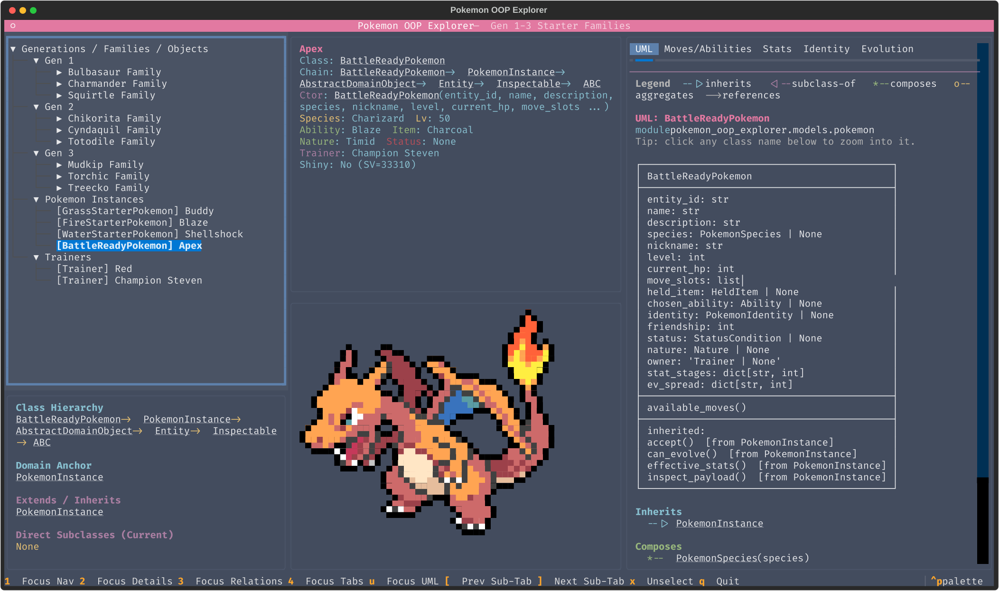

# Pokemon OOP Explorer (Textual TUI)

[](https://github.com/avih7531/pokemon-oop-explorer/actions/workflows/tests.yml)

An object-oriented terminal explorer for Gen 1-3 starter families and evolutions.  
This is intentionally not a generic Pokedex; it is a domain-modeling project focused on inheritance, composition, abstract interfaces, polymorphism, and clear architecture.



## Table of Contents

- [Virtual Environment Setup](#virtual-environment-setup)
- [Run The App](#run-the-app)
- [Run Tests](#run-tests)
- [Writeup](#writeup)
- [Project Tree](#project-tree)
- [Interaction Model](#interaction-model)
- [OOP Modeling Highlights](#oop-modeling-highlights)
- [Auto UML Tab](#auto-uml-tab)
- [Use Cases](#use-cases)
- [Included Data Scope](#included-data-scope)
- [Credits](#credits)

> **IMPORTANT!** Your terminal must be **at least 48 rows tall and 146 columns wide** for the three-pane TUI layout (navigation / details / UML) to render without clipping or broken box-drawing. Resize your terminal before launching the app.
>
> **Recommended terminal:** [Kitty](https://sw.kovidgoyal.net/kitty/). It has excellent support for truecolor, Unicode box-drawing, and the ANSI sprite renderer the app uses, so colors and the UML diagrams display correctly. Other terminals will usually work but may dim the palette or break the sprite output.

## Virtual Environment Setup

```bash
source venv/bin/activate
pip install -r requirements.txt
```

## Run The App

```bash
python -m pokemon_oop_explorer.main
```

## Run Tests

```bash
pytest -q
```

## Writeup

Project report files are in `writeup/`:

```bash
cd writeup
make
```

This compiles `writeup/writeup.tex` into `writeup/writeup.pdf`.

## Project Tree

```text
Project/
├── pyproject.toml
├── requirements.txt
├── README.md
├── image.png
├── docs/
│   └── uml/
│       ├── _theme.iuml
│       ├── use_cases/
│       │   ├── images/    (overview + UC-1..UC-8 .png)
│       │   └── sources/   (matching .puml sources)
│       ├── class_diagram/
│       │   ├── images/    (domain class diagram .png)
│       │   └── sources/   (matching .puml source)
│       └── sequences/
│           ├── images/    (seq-1..seq-7 .png)
│           └── sources/   (matching .puml sources)
├── writeup/
│   ├── Makefile
│   ├── writeup.tex
│   └── writeup.pdf
├── proposal/
│   └── PROJECT_PROPOSAL.md
├── sprites/
│   ├── regular/
│   └── shiny/
├── pokemon_oop_explorer/
│   ├── __init__.py
│   ├── main.py
│   ├── app.py
│   ├── data/
│   │   ├── __init__.py
│   │   └── starter_seed.py
│   ├── introspect/
│   │   ├── __init__.py
│   │   ├── class_graph.py
│   │   ├── relationship_detector.py
│   │   └── ascii_renderer.py
│   ├── models/
│   │   ├── __init__.py
│   │   ├── abilities.py
│   │   ├── base.py
│   │   ├── effects.py
│   │   ├── enums.py
│   │   ├── evolution.py
│   │   ├── items.py
│   │   ├── moves.py
│   │   ├── pokemon.py
│   │   ├── status.py
│   │   ├── trainer.py
│   │   ├── value_objects.py
│   │   └── visitor.py
│   ├── services/
│   │   ├── __init__.py
│   │   ├── repository.py
│   │   ├── sprite_service.py
│   │   └── stat_service.py
│   ├── theme/
│   │   └── explorer.tcss
│   └── ui/
│       ├── __init__.py
│       ├── presenters.py
│       └── widgets/
│           ├── __init__.py
│           └── panels.py
└── tests/
    ├── test_ascii_uml.py
    ├── test_class_graph.py
    ├── test_effects.py
    ├── test_evolution.py
    ├── test_identity.py
    ├── test_repository.py
    └── test_trainer.py
```

## Interaction Model

- **Left panel**: tree navigation by generation, family, object type, and trainer.
- **Center panel**: selected object detail payload (constructor signature, class info, domain fields) and sprite view.
- **Right panel**: inheritance chain and composition/aggregation relationships, pulled directly from the introspected class graph.
- **Lower tabs**: Moves/Abilities, Stats, Identity, Evolution, and **UML** (auto-generated ASCII class diagram for the current selection).
- Navigation supports arrow keys and Enter on the tree; focus shortcuts: `1` nav, `2` details, `3` relationships, `4` tabs, `u` jump to UML tab, `[` / `]` prev/next sub-tab, `x` unselect, `q` quit.

## OOP Modeling Highlights

- Concrete hierarchy for `PokemonSpecies` and `PokemonInstance` with starter specializations.
- Move, Item, Ability, and Evolution rule hierarchies with behavior-bearing classes.
- **Move effects** — `AbstractEffect` polymorphic hierarchy (`DamageEffect`, `HealEffect`, `StatusEffect`, `StatStageEffect`) composed into `Move.effects` so each move carries real behavior objects rather than flat numeric fields.
- **Status conditions** — `StatusCondition` ABC with `BurnStatus`, `PoisonStatus`, `ParalysisStatus`, `SleepStatus`, `FreezeStatus`; each overrides polymorphic `tick()` and `can_act()`.
- **Composite evolutions** — `CompositeEvolutionRule` (Composite pattern) combines `Level`, `Item`, `Friendship`, `Trade`, `Location`, and `TimeOfDay` rules with AND / OR semantics.
- **Trainer aggregate** — `Trainer` owns a `party: list[PokemonInstance]`; seeded trainers (Red, Champion Steven) own the example Pokemon and set `instance.owner` via `add_to_party()`.
- **Natures** — `Nature` value object with 25-style boosted/hindered stat modifiers applied during `effective_stats()` computation.
- **Visitor pattern** — `DomainVisitor` ABC with `ClassUsageVisitor` and `SummaryVisitor`; `AbstractDomainObject.accept(visitor)` enables double dispatch in place of `isinstance` chains in the UI layer.
- **Strategy-based introspection** — `introspect/` package ships `InheritanceDetector`, `CompositionDetector`, and `AggregationDetector` (all `EdgeDetector` subclasses) that build a `ClassGraph` consumed by `AsciiUmlRenderer` to produce the UML tab automatically.
- Supporting value objects:
  - `PokemonIdentity` with nested `ShinyComputation` (Gen 3 XOR logic)
  - `StatBlock` plus typed stat classes (`HPStat`, `AttackStat`, etc.)
  - `Type`, `Learnset`, `MoveSlot`, `EvolutionLine` with nested `EvolutionStage`
  - `SpriteAsset` abstraction for local ANSI sprite loading
- Species-level and instance-level concerns are explicitly separated.

## Auto UML Tab

The `UML` tab introspects the entire `pokemon_oop_explorer` package at startup via `ClassGraphBuilder`, then renders a focused class diagram whenever you select something in the navigation tree:

- UML-style box with the class name, its dataclass fields, and its own methods (compartmented in Unicode box-drawing characters).
- Below the box: `--|>` parent list, `<|--` subclass list, `*--` composition edges, `o--` aggregation edges, plus a "Used By" inbound-edge list.
- When nothing is selected, the tab renders a package-wide overview grouped by module.
- No extra dependencies — the renderer is pure Python, driven by the same pluggable `EdgeDetector` strategies you can extend yourself.

## UML Deliverables

- **Use Cases (overview + activities):** [`docs/uml/use_cases/`](docs/uml/use_cases/)
- **Class Diagram (implementation-aligned):** [`docs/uml/class_diagram/`](docs/uml/class_diagram/)
- **Sequence Diagrams (implementation message flows):** [`docs/uml/sequences/`](docs/uml/sequences/)
- **Shared PlantUML theme:** [`docs/uml/_theme.iuml`](docs/uml/_theme.iuml)

## Use Cases

**Actor:** a student or reviewer running the app in a terminal to study the object model and starter-line data.

> UML diagrams for every use case (PlantUML sources + rendered PNGs in the project color palette) live under [`docs/uml/use_cases/`](docs/uml/use_cases/) — images in [`images/`](docs/uml/use_cases/images/), sources in [`sources/`](docs/uml/use_cases/sources/). Start with [`overview.png`](docs/uml/use_cases/images/overview.png) for the actor-and-use-cases diagram; each `uc-N_*.png` is an activity diagram for the corresponding row below.

| ID   | Use case                   | Summary                                                                                                                                           |
| ---- | -------------------------- | ------------------------------------------------------------------------------------------------------------------------------------------------- |
| UC-1 | Browse the catalog         | Open the app and navigate the tree by generation, starter family, and domain object (e.g., species vs. instance) to locate a Pokémon of interest. |
| UC-2 | Inspect domain objects     | Select an object and read structured detail in the center pane (fields, types, and how the class represents the concept).                         |
| UC-3 | View class relationships   | See inheritance and composition or associations for the current selection so design choices (interfaces, hierarchies) are visible while browsing. |
| UC-4 | Review moves and abilities | Use the Moves/Abilities tab to inspect learnsets and ability bindings tied to the species or instance model.                                      |
| UC-5 | Analyze stats              | Use the Stats tab to examine base or computed stats and how stat objects fit the domain layer.                                                    |
| UC-6 | Explore identity mechanics | Use the Identity tab to inspect identifiers and shiny-related logic (e.g., Gen 3-style computation) at the value-object level.                    |
| UC-7 | Trace evolution            | Use the Evolution tab to follow evolution rules and stages for a starter line without simulating full battles.                                    |
| UC-8 | Preview sprites            | View locally cached regular and shiny sprite output alongside textual detail for visual confirmation of species or instance context.              |


**Out of scope for these use cases:** competitive battle simulation, network live PokeAPI calls during normal use (data is expected to be cached/seeded), and coverage of Pokémon outside the Gen 1–3 starter families listed in scope.

## Included Data Scope

Gen 1-3 starter families are seeded:
Bulbasaur line, Charmander line, Squirtle line, Chikorita line, Cyndaquil line, Totodile line, Treecko line, Torchic line, and Mudkip line.

Plus: two seeded trainers (`Red`, `Champion Steven`) owning the example party, natures assigned per instance, and a burn status on the Charmander example to exercise the `StatusCondition` hierarchy.

## Credits

- **Pokemon data** — species, stats, move definitions, abilities, and evolution chains are fetched from [PokeAPI](https://pokeapi.co/) (cached locally in `pokeapi_cache.json`). Thanks to the PokeAPI maintainers for the free, open dataset.
- **Pokemon sprites** — all ANSI Pokemon sprites under `sprites/regular/` and `sprites/shiny/` come from [pokemon-colorscripts](https://gitlab.com/phoneybadger/pokemon-colorscripts) by phoneybadger. Huge thanks for the beautiful half-block renditions.
- **Trainer sprites** — the Red and Steven sprites are hand-drawn by me (pixel grid + ANSI half-block encoder). The quality gap between them and the phoneybadger sprites should be immediately, painfully obvious.

